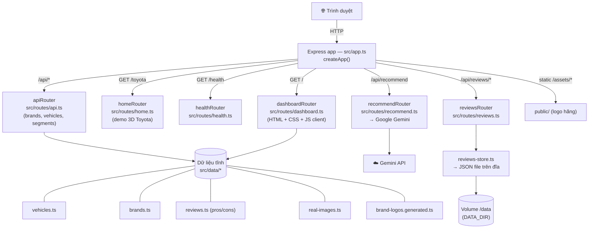
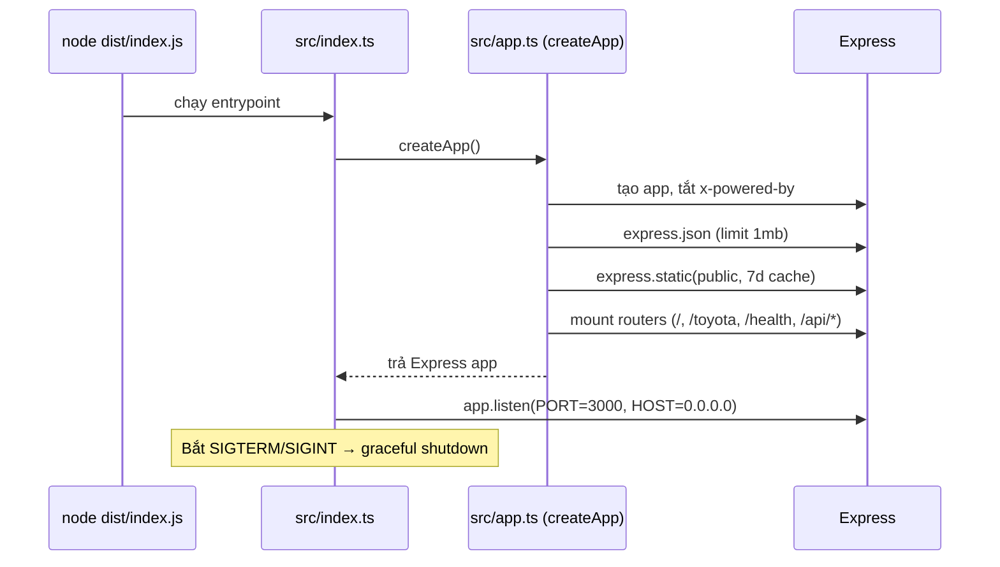
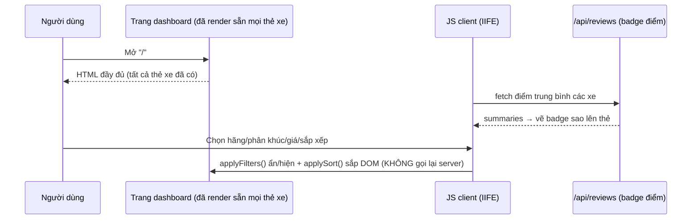
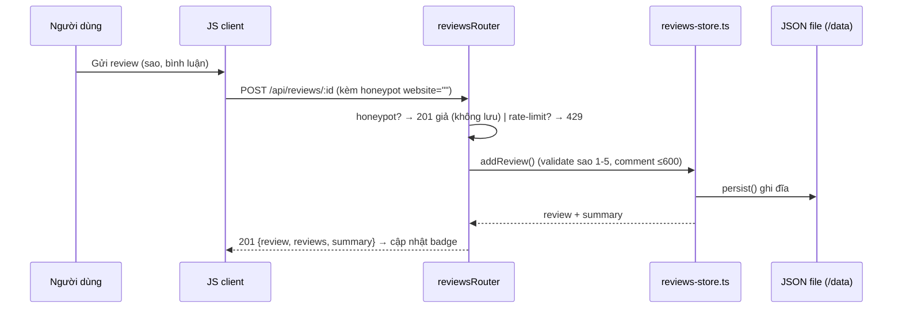
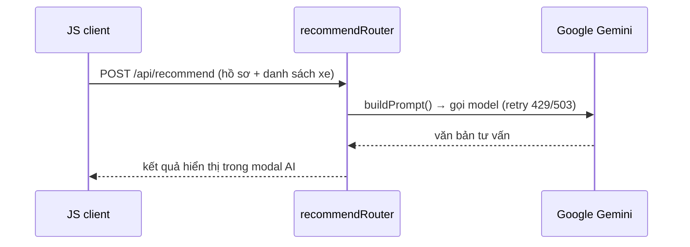

# Auto-review — Tài liệu Kiến trúc (Architecture)

> Ứng dụng web **danh mục & tư vấn xe đa hãng** cho thị trường Việt Nam.
> Stack: **Node 20 + TypeScript (ESM, strict) + Express 4**. Render HTML phía server,
> client JS thuần (vanilla), không framework. Triển khai trên **Fly.io** (app `autoiq`).

---

## 1. Tổng quan ứng dụng

Auto-review là một SPA-lite render từ server: toàn bộ giao diện dashboard là **một trang HTML
duy nhất** sinh trong [src/routes/dashboard.ts](src/routes/dashboard.ts), kèm CSS + JS client
nhúng trong template. Dữ liệu xe là **dữ liệu tĩnh trong code** (không cần DB), chỉ riêng phần
**đánh giá người dùng (reviews)** được lưu bền trên đĩa (JSON file trên volume Fly.io).

### Tính năng chính
| Nhóm | Tính năng |
| --- | --- |
| Danh mục | Danh sách xe đa hãng, lọc theo hãng/phân khúc/nhiên liệu/giá/đánh giá, sắp xếp, tìm kiếm |
| Chi tiết xe | Thông số kỹ thuật, ưu/nhược điểm, lịch bảo dưỡng, phụ tùng, ảnh thật, xe tương tự |
| Tương tác | Yêu thích (favorite), lịch sử xem gần đây, chia sẻ link sâu (`?v=<id>`) |
| Đánh giá | Gửi review (sao + bình luận), badge điểm trung bình, vote "hữu ích", chống spam (rate-limit + honeypot) |
| Công cụ | Máy tính chi phí lăn bánh/vận hành, so sánh xe |
| AI | Gợi ý xe phù hợp qua Google Gemini ([/api/recommend](src/routes/recommend.ts)) |
| Giao diện | Theme Sáng/Tối **và** theme **Hand-drawn (vẽ tay)** bật/tắt độc lập |
| Khác | Trang demo Toyota 3D ([/toyota](src/routes/home.ts)), health check, SEO/OG meta |

---

## 2. Sơ đồ luồng tổng thể

---

## 3. Luồng khởi động (bootstrap)

---

## 4. Cấu trúc thư mục & mục đích từng file

### 4.1 Mã nguồn `src/`

| File | Mục đích |
| --- | --- |
| [src/index.ts](src/index.ts) | Entrypoint. Tạo app, `listen`, xử lý graceful shutdown (SIGTERM/SIGINT). |
| [src/app.ts](src/app.ts) | Factory `createApp()`. Cấu hình middleware & **mount toàn bộ router**. Tách khỏi `index.ts` để test bằng supertest. |

#### Routes (`src/routes/`)
| File | Endpoint | Mục đích |
| --- | --- | --- |
| [src/routes/dashboard.ts](src/routes/dashboard.ts) | `GET /` | **Trang chính**. Sinh 1 trang HTML đầy đủ (template literal lớn) gồm CSS, body và **JS client** (IIFE). Render thẻ xe, modal chi tiết, bộ lọc, máy tính chi phí, reviews, theme toggle. File lớn nhất về logic UI. |
| [src/routes/home.ts](src/routes/home.ts) | `GET /toyota` | Trang demo Toyota với model 3D (`<model-viewer>` + file `.glb`). Độc lập với dashboard. |
| [src/routes/api.ts](src/routes/api.ts) | `GET /api/brands`, `/api/segments`, `/api/brands/:slug/vehicles`, `/api/vehicles`, `/api/vehicles/:id` | API JSON danh mục. `toCard()` trả bản rút gọn cho list; `/vehicles/:id` trả đầy đủ + lịch bảo dưỡng + phụ tùng. |
| [src/routes/reviews.ts](src/routes/reviews.ts) | `GET /api/reviews`, `/:id`, `POST /:id`, `POST /:id/:reviewId/helpful` | CRUD đánh giá người dùng. Chống spam: **rate-limit** (6 req/60s/IP) + **honeypot** (`website`). Vote "hữu ích". |
| [src/routes/recommend.ts](src/routes/recommend.ts) | `POST /api/recommend` | Gọi **Google Gemini** tư vấn/so sánh xe. Có retry khi 429/503, tôn trọng `Retry-After`. Model qua `GEMINI_MODEL`. |
| [src/routes/health.ts](src/routes/health.ts) | `GET /health` | Health check: status, uptime, timestamp (dùng cho Fly.io & CI). |

#### Dữ liệu (`src/data/`)
| File | Mục đích |
| --- | --- |
| [src/data/vehicles.ts](src/data/vehicles.ts) | **CSDL xe** (lớn nhất). `interface Vehicle`, mảng `vehicles`, helper `getVehicle/getVehiclesByBrand/getSegments/getMaintenanceSchedule/getPartsCatalog`. Gộp ảnh thật + pros/cons. Mở rộng = thêm 1 dòng. |
| [src/data/brands.ts](src/data/brands.ts) | Cấu hình hãng xe (slug, tên, nước, màu, wordmark, logo). `getBrand()`. |
| [src/data/reviews.ts](src/data/reviews.ts) | Ưu/nhược điểm (pros/cons) viết tay riêng cho từng mẫu xe. |
| [src/data/real-images.ts](src/data/real-images.ts) | Map `id → URL ảnh thật` (Wikimedia). **Tự sinh** bởi `scripts/fetch-images.mjs`, không sửa tay. |
| [src/data/brand-logos.generated.ts](src/data/brand-logos.generated.ts) | Map `slug → đường dẫn logo` trong `public/`. **Tự sinh** bởi `scripts/gen-logo-manifest.mjs`. |
| [src/data/reviews-store.ts](src/data/reviews-store.ts) | **Lưu trữ đánh giá người dùng** (runtime). Đọc/ghi JSON tại `DATA_DIR` (`/data` trên Fly), seed mẫu, validate, `summarize/summarizeAll/voteHelpful`. Lớp persistence duy nhất của app. |

#### Test (`*.test.ts`) — Vitest + supertest
Mỗi router có file test tương ứng: `health/home/dashboard/api/recommend/reviews.test.ts`. Tổng **32 test**.

### 4.2 Tài nguyên tĩnh & build
| Đường dẫn | Mục đích |
| --- | --- |
| `public/assets/brands/*` | Logo các hãng (SVG/PNG) phục vụ tĩnh. |
| `docs/index.html` | Trang cho GitHub Pages. |
| `scripts/*.mjs` | Script tiện ích: tải ảnh xe, tải logo, sinh manifest logo. |
| `tsconfig.json` / `tsconfig.build.json` | Cấu hình TS (dev/typecheck vs build ra `dist/`). |
| `eslint.config.js`, `.prettierrc.json` | Lint & format. |
| `vitest.config.ts`, `nodemon.json` | Cấu hình test & dev watch. |

### 4.3 Triển khai (Deploy)
| File | Mục đích |
| --- | --- |
| `Dockerfile` | Build image production (copy `public`, chạy bằng `su-exec`). |
| `docker-entrypoint.sh` | Entrypoint container (chỉnh quyền volume rồi chạy app). |
| `fly.toml` | Cấu hình Fly.io: app `autoiq`, region `sin`, mount volume `data → /data`, `DATA_DIR=/data`. |
| `.dockerignore`, `.gitignore`, `.gitattributes` | Loại trừ file khi build/commit; `/data/` không commit. |

### 4.4 CI/CD (`.github/workflows/`)
| Workflow | Mục đích |
| --- | --- |
| `ci.yml` | Build + test + lint mỗi push/PR. |
| `deploy.yml` | Deploy lên Fly.io. |
| `docker-publish.yml` | Build & publish Docker image. |
| `pages.yml` | Xuất bản GitHub Pages (`docs/`). |
| `codeql.yml`, `semgrep.yml` | Quét bảo mật mã nguồn. |
| `ai-review.yml` | Tự động review PR bằng AI (rule ở `.github/ai-review-rules.md`). |

---

## 5. Luồng dữ liệu các tính năng tiêu biểu

### 5.1 Xem & lọc danh mục (client-side)

> Lọc/sắp xếp/yêu thích/lịch sử xem chạy **hoàn toàn ở client** (localStorage: `ar-fav`,
> `ar-recent`, `ar-helpful`, `ar-theme`, `ar-skin`). Server chỉ cung cấp điểm review & nhận review mới.

### 5.2 Gửi & vote đánh giá (có persistence)

### 5.3 Tư vấn AI

---

## 6. Quy ước & ràng buộc kỹ thuật (quan trọng khi sửa code)

- **JS/CSS client nằm trong template literal** của `dashboard.ts`: KHÔNG dùng backtick, KHÔNG `${`
  (trừ nội suy server có chủ đích), không chú thích TS, regex phải nhân đôi `\\`, ký tự `#`
  trong SVG data URI phải viết `%23`.
- `req.params` có kiểu `string | string[]` → luôn ép `String(...)`.
- TypeScript strict, ESM: import nội bộ kèm đuôi `.js`.
- **Validate sau mỗi thay đổi:** `npm run build && npx vitest run --silent && npm run lint` (32 test phải xanh).
- Theme **Hand-drawn** chỉ override design token + viền/nền; **không** áp filter lên ảnh xe & logo hãng.

## 7. Lệnh thường dùng

| Lệnh | Tác dụng |
| --- | --- |
| `npm run dev` | Dev server (nodemon, port 3000) |
| `npm run build` | Biên dịch TS → `dist/` |
| `npm start` | Chạy bản build (`node dist/index.js`) |
| `npm test` | Chạy test (Vitest) |
| `npm run lint` / `npm run format` | Lint / format |
| `flyctl deploy` | Deploy lên Fly.io (app `autoiq`) |

## 8. Biến môi trường

| Biến | Mặc định | Ý nghĩa |
| --- | --- | --- |
| `PORT` | `3000` | Cổng lắng nghe |
| `HOST` | `0.0.0.0` | Địa chỉ bind |
| `DATA_DIR` | (thư mục tạm/cwd) | Nơi lưu JSON đánh giá; trên Fly = `/data` (volume) |
| `GEMINI_API_KEY` | — | Khóa gọi Gemini cho `/api/recommend` |
| `GEMINI_MODEL` | `gemini-2.0-flash` | Model Gemini sử dụng |
